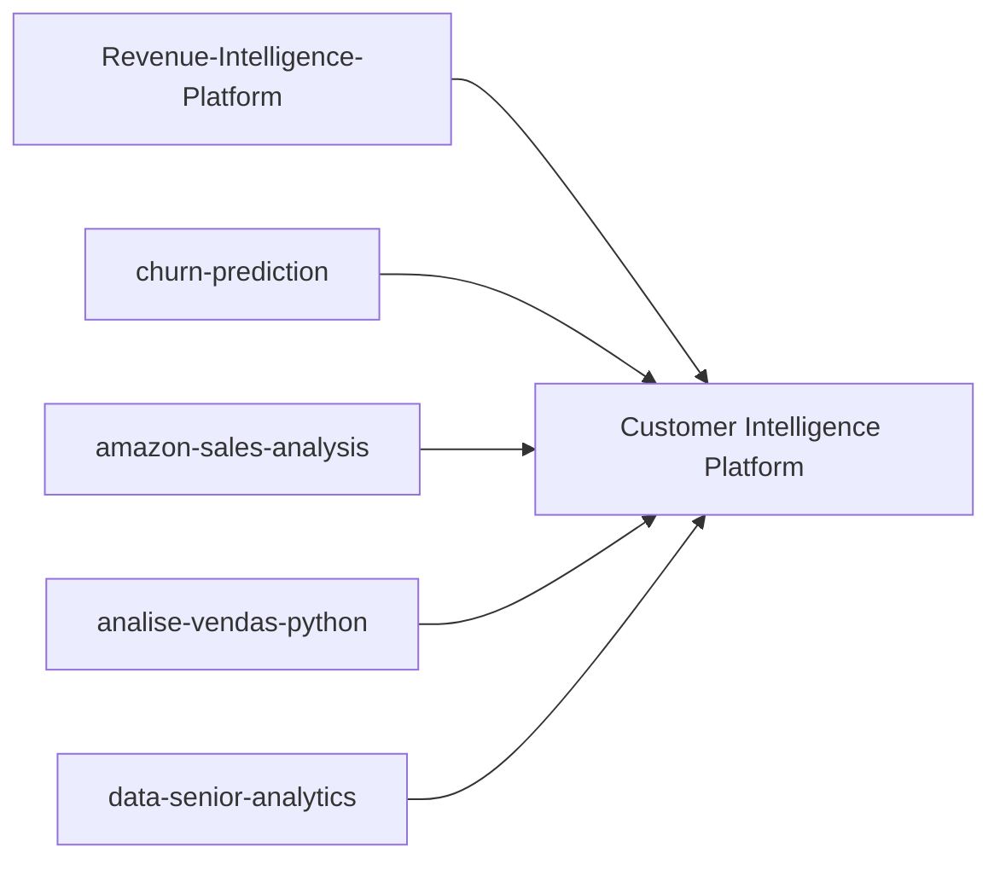

# Customer Intelligence Platform (Revenue + Retention)

Plataforma end-to-end de dados e ML para inteligencia de receita e retencao, unificando cinco repositorios em um unico sistema modular.

## Architecture

```mermaid
flowchart TD
  subgraph Sources["Data Sources"]
    S1[CRM / ERP / CSV]
    S2[E-commerce / Sales]
    S3[Marketing Spend]
  end

  subgraph Pipeline["Data Platform (raw -> bronze -> silver -> gold)"]
    I[Ingestion]
    Q[Data Quality (Pandera)]
    T[Transforms + Star Schema]
  end

  subgraph ML["ML Layer"]
    M1[Churn Model]
    M2[Next Purchase Model]
    M3[LTV / Segmentation]
    R[Recommendation / Prioritization]
  end

  subgraph Serving["Serving & Apps"]
    A1[Batch Scoring]
    A2[API (FastAPI optional)]
    D1[Executive Streamlit Dashboard]
    D2[Sales Analytics Streamlit]
  end

  Sources --> I --> Q --> T
  T --> M1 --> R --> A1 --> D1
  T --> M2 --> R
  T --> M3 --> R
  A2 --> D1
  A2 --> D2
```

## Module Composition



## Repository Layout

```text
revenue-intelligence-platform-suite/
|- README.md
|- docs/
|  |- architecture.md
|  |- data-contracts.md
|  `- adr/
|- datasets/
|- modules/
|  |- revenue-intelligence/
|  |- churn-prediction/
|  |- amazon-sales-analysis/
|  |- analise-vendas-python/
|  `- data-senior-analytics/
|- platform/
|  |- ingestion/
|  |- transform/
|  |- modeling/
|  |- quality/
|  |- orchestration/
|  `- serving/
|- apps/
|  |- executive-dashboard/
|  `- sales-analytics/
|- packages/
|  `- common/
|- tests/
`- pyproject.toml
```

## Module Mapping (Closed Scope)

- `modules/revenue-intelligence` -> Revenue-Intelligence-Platform-End-to-End-Analytics-ML-System
- `modules/churn-prediction` -> churn-prediction
- `modules/amazon-sales-analysis` -> amazon-sales-analysis
- `modules/analise-vendas-python` -> analise-vendas-python
- `modules/data-senior-analytics` -> data-senior-analytics

## Integration Strategy

- Default strategy: `git subtree` para monorepo real e simples de clonar.
- Alternative strategy: `git submodule` se quiser atualizacao desacoplada por repo.

Subtree import example:

```bash
git remote add churn https://github.com/<user>/churn-prediction.git
git subtree add --prefix modules/churn-prediction churn main --squash
```

## Quickstart

```bash
python -m venv .venv
# Linux/macOS
source .venv/bin/activate
# Windows PowerShell
.venv\Scripts\Activate.ps1
pip install -e ".[dev]"
streamlit run apps/executive-dashboard/app.py
```

## Business Impact

- Identificacao de clientes de alto valor e alto risco de churn.
- Priorizacao acionavel para retencao, receita incremental e eficiencia comercial.
- Simulacao de uplift com trilha de qualidade e reproducibilidade.

## Tech Stack

Python, SQL, Streamlit, scikit-learn, Prefect, Pandera, MLflow, Pytest, Docker.
