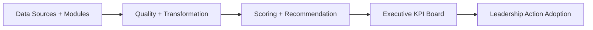
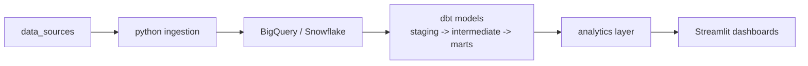
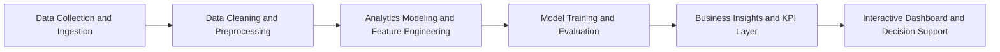

# Revenue-Intelligence-Platform-Suite

Flagship analytics platform for revenue performance, retention exposure, governance, and executive decision support.

[](https://github.com/samuelmaia-analytics/revenue-intelligence-platform-suite/actions/workflows/ci.yml)
[](https://github.com/samuelmaia-analytics/revenue-intelligence-platform-suite/actions/workflows/publish-release.yml)
[](https://github.com/samuelmaia-analytics/revenue-intelligence-platform-suite/actions/workflows/showcase-monitoring.yml)
[](https://github.com/samuelmaia-analytics/revenue-intelligence-platform-suite/releases/tag/v1.0.0)

Live demo: https://revenue-intelligence-platform-suite.streamlit.app/

## Language

- English (canonical): [README.md](README.md)
- Portuguese (BR): [README.pt-BR.md](README.pt-BR.md)
- Portuguese (PT): [README.pt-PT.md](README.pt-PT.md)

## Executive Summary

This repository is the strongest platform-level proof in the portfolio.
It presents a production-minded analytical system that brings together revenue analytics, retention prioritization, governance artifacts, quality controls, shared contracts, observability, and executive-facing applications.

Instead of showing isolated analytics projects, it shows how multiple analytical capabilities can be organized as one decision platform.

## Business Context

The showcase use case is explicit: reduce B2B revenue churn by ranking retention actions by financial impact.

- Use case definition: [docs/showcase-use-case.md](./docs/showcase-use-case.md)
- Executive app: `apps/executive-dashboard/app.py`
- KPI board: `apps/executive-dashboard/pages/1_Executive_KPI_Board.py`
- Modules portal: `apps/executive-dashboard/pages/2_Modules_Access.py`

## What This Platform Answers

1. Which accounts have the highest revenue at risk this week?
2. Which action should leadership execute first?
3. What recovery and ROI are expected under each scenario?
4. How can governance, contracts, and observability support repeatable analytical delivery?

## Why This Repository Matters

- It proves platform thinking, not only project execution.
- It connects analytical outputs to executive prioritization.
- It shows governance, release discipline, observability, and reusable contracts.
- It organizes multiple repositories as one coherent analytical operating model.

## Platform Architecture



The platform architecture connects source modules, quality controls, scoring logic, executive KPI visibility, and action adoption monitoring.

## Modern Data Stack Path



This path is implemented in `modules/revenue-intelligence`, including optional warehouse loading and a complete dbt project.

## Analytical System Flow



## Monorepo Structure

```text
revenue-intelligence-platform-suite/
|- apps/                     # executive and operational apps
|- modules/                  # integrated portfolio repositories
|- platform/                 # platform architecture namespaces
|- platform_connectors/      # runtime-safe telemetry connectors
|- platform_observability/   # runtime-safe observability services
|- packages/common/          # shared contracts and utilities
|- reports/showcase/         # generated showcase artifacts
|- docs/                     # architecture, governance, proof, releases
`- tests/                    # root validation and smoke tests
```

## Core Modules

- [modules/revenue-intelligence](./modules/revenue-intelligence)
- [modules/churn-prediction](./modules/churn-prediction)
- [modules/analise-vendas-python](./modules/analise-vendas-python)
- [modules/amazon-sales-analysis](./modules/amazon-sales-analysis)
- [modules/data-senior-analytics](./modules/data-senior-analytics)

## What Each Module Proves

| Module | What it proves |
|---|---|
| [modules/revenue-intelligence](./modules/revenue-intelligence) | End-to-end revenue retention system design, from KPI board to prioritized executive actions. |
| [modules/churn-prediction](./modules/churn-prediction) | Churn-risk modeling quality with temporal validation and deployable scoring workflow. |
| [modules/analise-vendas-python](./modules/analise-vendas-python) | Commercial analytics depth in Python with KPI storytelling for sales leadership. |
| [modules/amazon-sales-analysis](./modules/amazon-sales-analysis) | Revenue leakage diagnostics and category-level opportunity sizing with reproducible analysis. |
| [modules/data-senior-analytics](./modules/data-senior-analytics) | Senior analytics framing: translating technical outputs into executive tradeoffs and decisions. |

## Governance, Quality, and CI/CD

- Shared contracts in `packages/common/contracts`
- Root CI plus per-module validation matrix
- Executive app smoke testing
- Observability logs for action adoption events
- Release workflow and quarterly operating cadence
- Security and contribution guidance in [SECURITY.md](./SECURITY.md) and [CONTRIBUTING.md](./CONTRIBUTING.md)

## Business Evidence

### Current Operating Baseline

- Current release: `v1.0.0` (March 5, 2026)
- Release notes: [docs/releases/v1.0.0.md](./docs/releases/v1.0.0.md)
- Quarterly notes: [docs/releases/2026-Q1.md](./docs/releases/2026-Q1.md)

### Published Deltas

| Release | Published delta | Evidence |
|---|---|---|
| `v1.0.0` | Executive prioritization moved from static mock insights to telemetry-backed decisioning; quantified exposure at `$144,490.04` total revenue at risk and `$29,130.33` in top-50 priority accounts. | [docs/releases/v1.0.0.md](./docs/releases/v1.0.0.md), [reports/showcase/summary.json](./reports/showcase/summary.json) |
| `2026-Q1` | Platform operating baseline established for repeatable quarterly reporting, contracts, CI matrix, and observability logs. Action adoption tracking is live with a first-quarter baseline of `0` recorded events. | [docs/releases/2026-Q1.md](./docs/releases/2026-Q1.md), [reports/showcase/action_adoption_metrics.json](./reports/showcase/action_adoption_metrics.json) |

## Quick Start

### 1. Generate showcase artifacts

```bash
python scripts/run_showcase_demo.py
```

### 2. Launch the executive app

```bash
streamlit run apps/executive-dashboard/app.py
```

### 3. Optional Modern Data Stack demo

```powershell
powershell -ExecutionPolicy Bypass -File .\modules\revenue-intelligence\scripts\run_modern_data_stack_demo.ps1
```

### 4. Recommended local setup

```powershell
powershell -ExecutionPolicy Bypass -File .\modules\revenue-intelligence\scripts\setup_envs.ps1
```

### 5. dbt local helper

```powershell
powershell -ExecutionPolicy Bypass -File .\modules\revenue-intelligence\scripts\run_dbt_local.ps1 -Target ci -WithTests
```

## Main Outputs

- `reports/showcase/summary.json`
- `reports/showcase/enterprise_telemetry.sqlite`
- `reports/showcase/top_actions.csv`
- `reports/showcase/drift_report.json`
- `reports/showcase/action_adoption_metrics.json`

## Evidence and Documentation

- [docs/proof.md](./docs/proof.md)
- [docs/executive-brief.md](./docs/executive-brief.md)
- [docs/kpi-scorecard.md](./docs/kpi-scorecard.md)
- [docs/governance-raci.md](./docs/governance-raci.md)
- [docs/compliance-checklist.md](./docs/compliance-checklist.md)
- [docs/dbt-docs-publishing.md](./docs/dbt-docs-publishing.md)

Published dbt docs URL: https://samuelmaia-analytics.github.io/revenue-intelligence-platform-suite/

## Where to Click in the App

- Open `Executive KPI Board`
- Review `Leadership Actions This Week`
- Use `Action Adoption Monitoring` to log outcomes by `action_id`

## Next Milestones

1. Replace the SQLite mock with live enterprise warehouse or API connectors.
2. Add automated drift monitoring for model and KPI quality.
3. Publish action-outcome deltas with accepted and in-progress adoption evidence.
