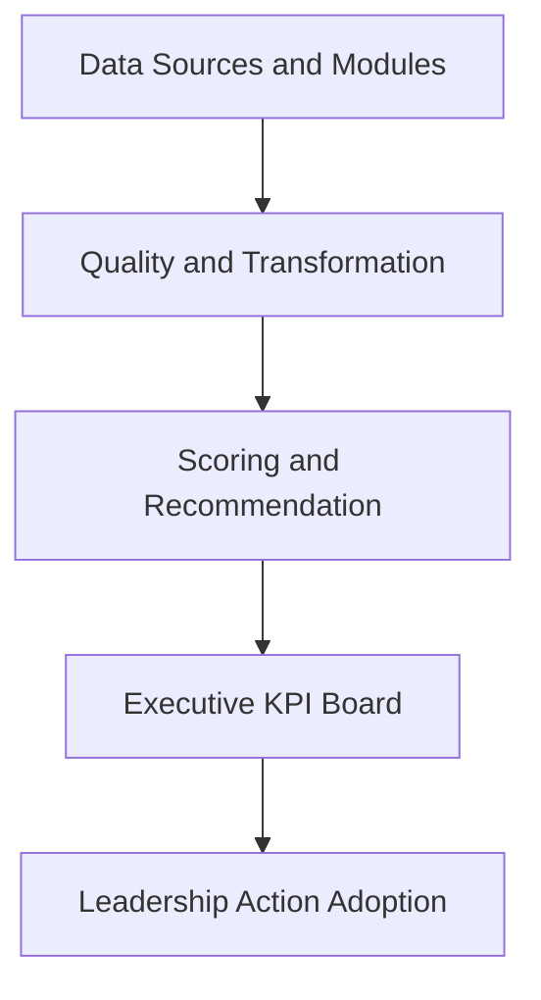

# Revenue-Intelligence-Platform-Suite

Flagship decision platform for Revenue and Retention leadership.

## Language
- English (canonical): [README.md](README.md)
- Portuguese (BR): [README.pt-BR.md](README.pt-BR.md)
- Portuguese (PT): [README.pt-PT.md](README.pt-PT.md)

## Why This Exists
Most portfolios show isolated analytics projects. This repository shows a production-minded platform:
- integrated modules in one monorepo
- executive decision layer with action prioritization
- shared contracts, CI, governance, and release cadence

## Official Showcase Use Case
Reduce B2B revenue churn by ranking retention actions by financial impact.
- Definition: [docs/showcase-use-case.md](./docs/showcase-use-case.md)
- Flagship app: `apps/executive-dashboard/app.py`
- Executive board: `apps/executive-dashboard/pages/1_Executive_KPI_Board.py`
- Modules portal: `apps/executive-dashboard/pages/2_Modules_Access.py`

## Executive Questions This Platform Answers
1. Which accounts have the highest revenue-at-risk this week?
2. Which action should leadership execute first?
3. What recovery and ROI are expected under each scenario?

## Architecture


## Monorepo Structure
```text
revenue-intelligence-platform-suite/
|- apps/                     # executive and operational apps
|- modules/                  # integrated portfolio repositories
|- platform/                 # platform architecture namespaces
|- platform_connectors/      # runtime-safe telemetry connectors
|- platform_observability/   # runtime-safe observability services
|- packages/common/          # shared contracts and utilities
|- reports/showcase/         # generated showcase artifacts
|- docs/                     # architecture, governance, proof, releases
`- tests/                    # root validation and smoke tests
```

## Core Modules
- [modules/revenue-intelligence](./modules/revenue-intelligence)
- [modules/churn-prediction](./modules/churn-prediction)
- [modules/analise-vendas-python](./modules/analise-vendas-python)
- [modules/amazon-sales-analysis](./modules/amazon-sales-analysis)
- [modules/data-senior-analytics](./modules/data-senior-analytics)

## Production-Grade Baseline
- Enterprise-like telemetry connector: SQLite mock with connector interface
- Contract testing: shared schemas in `packages/common/contracts`
- Observability: action adoption events logged to CSV and JSONL
- CI: root checks + per-module matrix + executive app smoke test

## Quick Start (2 steps)
1. Generate showcase artifacts:
```bash
python scripts/run_showcase_demo.py
```
2. Launch the executive app:
```bash
streamlit run apps/executive-dashboard/app.py
```

### Expected Outputs
- `reports/showcase/summary.json`
- `reports/showcase/enterprise_telemetry.sqlite`
- `reports/showcase/top_actions.csv`

### Where to Click in the App
- Click `Open Executive KPI Board` on the home page.
- Review `Leadership Actions This Week`.
- Use `Action Adoption Monitoring` to log outcomes by `action_id`.

## Evidence and Governance
- [docs/proof.md](./docs/proof.md)
- [docs/executive-brief.md](./docs/executive-brief.md)
- [docs/kpi-scorecard.md](./docs/kpi-scorecard.md)
- [docs/governance-raci.md](./docs/governance-raci.md)
- [docs/compliance-checklist.md](./docs/compliance-checklist.md)
- [SECURITY.md](./SECURITY.md)

## Release Cadence
- Current release: `v1.0.0` (March 5, 2026)
- Release notes: [docs/releases/v1.0.0.md](./docs/releases/v1.0.0.md)
- Quarterly notes: [docs/releases/2026-Q1.md](./docs/releases/2026-Q1.md)

## Next Milestones
1. Replace SQLite mock with live enterprise warehouse/API connectors.
2. Add automated drift monitoring for model and KPI quality.
3. Publish realized business deltas each quarter.
